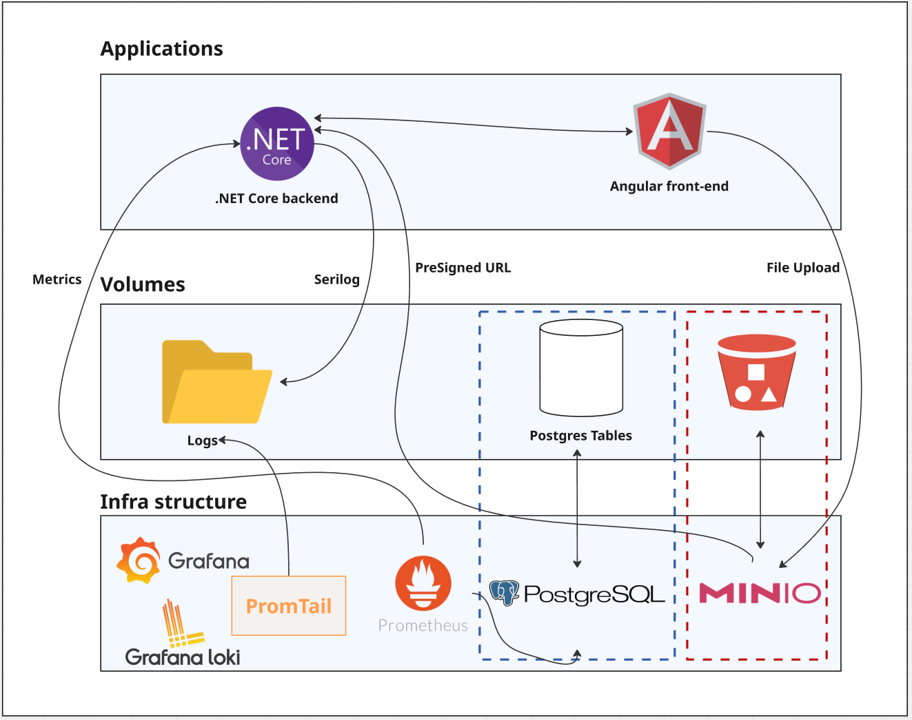
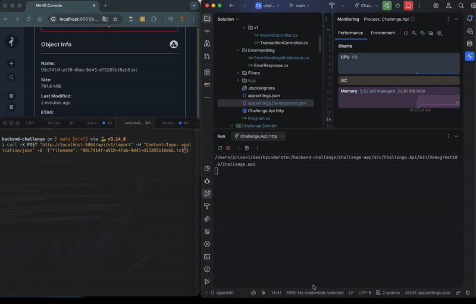
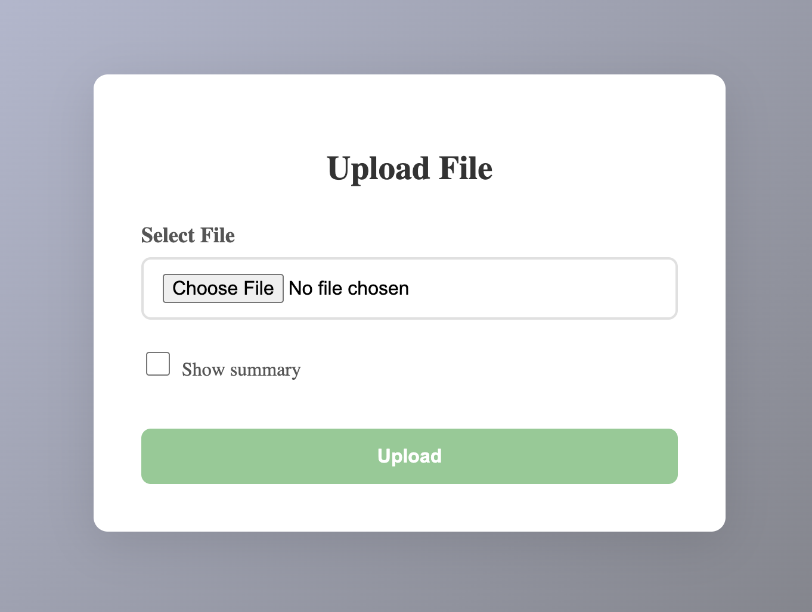
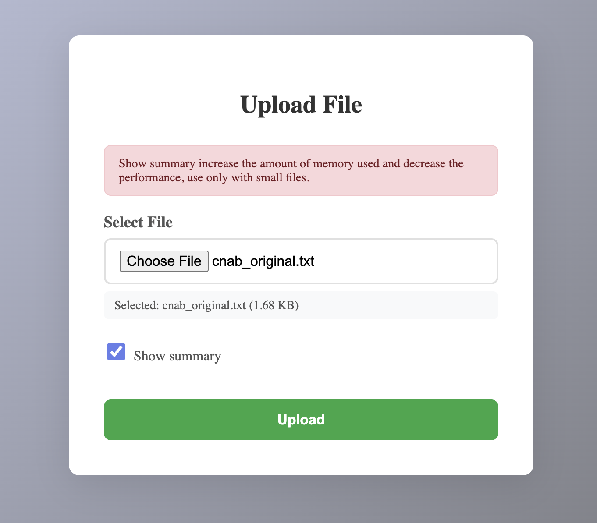
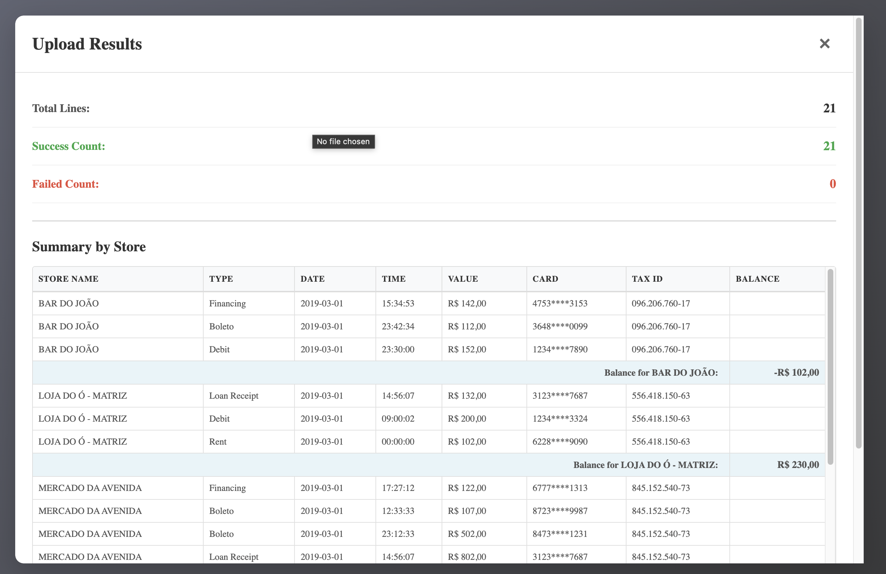
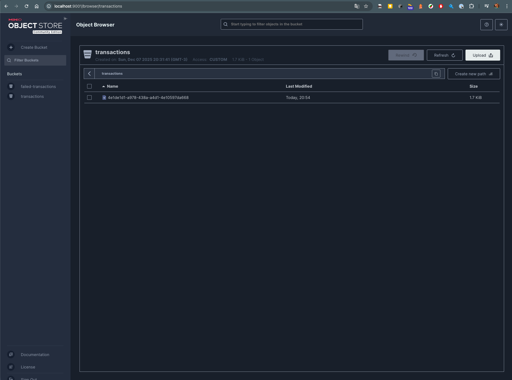
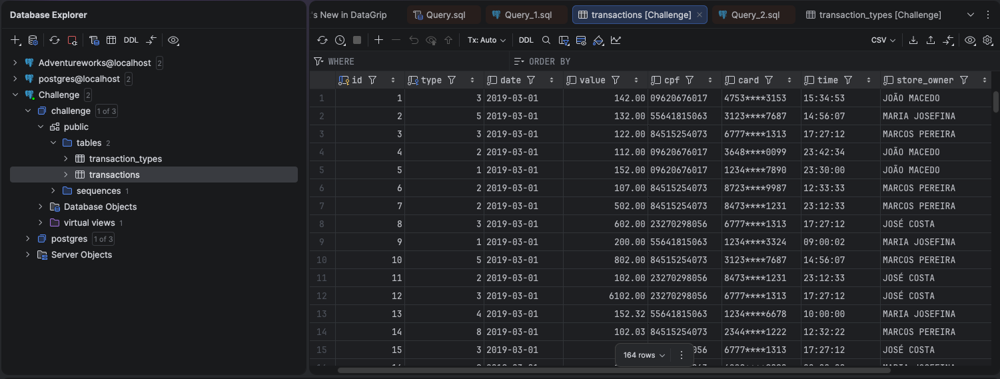
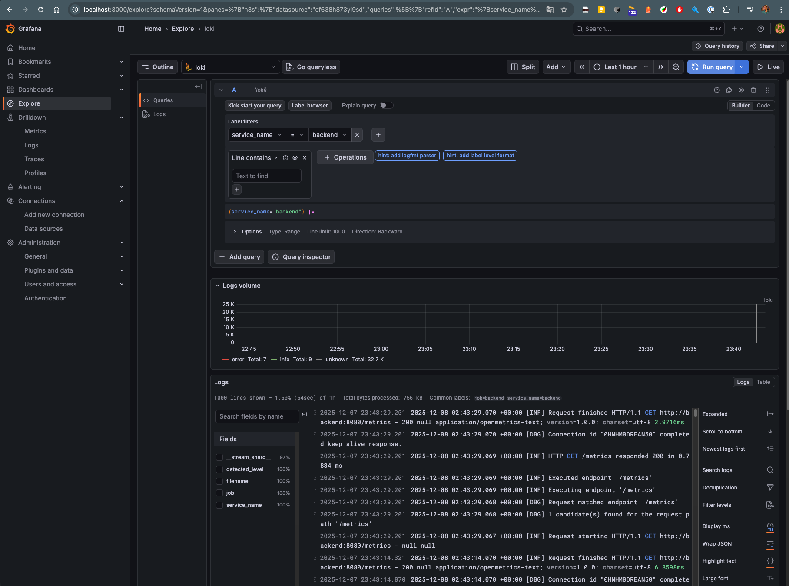

# Challenge

The challenge was to create a transaction file upload, where each line would be stored in the database for later reference.

The focus was not on completing the project as a whole, but rather on creating a robust architecture capable of supporting a very large scale without compromising performance or using excessive computational resources.

Another focus was on code extensibility, maintainability, and testability.

## Architecture
The initial architectural idea for this exercise involves an Angular front-end making requests to a .NET backend. The .NET application manages its logs by exporting them to a local folder in the form of a structured log file, which is then mapped to a volume managed by Docker Compose. Within the same Docker Compose definition file, we also have Grafana, Grafana Loki, and Promtail, which reads these log files and indexes them for viewing within Grafana. We also use Postgres for data persistence and Minio, which is an object storage service that implements the AWS S3 API. 

The idea behind this architecture is to enable production-level scaling. Since we are talking about a transaction file, it can typically have millions, if not billions, of lines. For this reason, we cannot upload directly to the backend server. This can compromise performance and is not the most appropriate approach when we are talking about a production system with this type of scale. Therefore, the front-end makes a request to the backend for a pre-signed URL and, with this pre-signed URL, uploads directly to the bucket, in this case managed by Minio. Next, the backend application downloads this file, processes it, and persists this data within Postgres.



The `challenge-api` service runs the backend .NET application, which exposes all API endpoints for processing file uploads, importing transactions, and interacting with storage and database resources. 
The `frontend` service runs the Angular-based front-end application, providing users with a graphical interface to interact with the system and manage transaction file uploads.  
The `postgres` service provides a reliable Postgres database to persist all imported transaction data, ensuring fast storage and retrieval for the backend application.  
The `minio` service acts as an S3-compatible object storage solution, handling scalable file storage for uploaded transaction files without putting pressure on the backend server.  
The `grafana` service enables interactive dashboards and monitoring, visualizing metrics and logs collected from all components of the system.  
The `loki` service efficiently stores log data, providing log aggregation capabilities for the whole stack, while `promtail` collects and ships logs from the application to Loki for indexing and visualization within Grafana.

### Back End Application - Challenge API

To ensure scalability and efficient memory usage, the backend processes transaction files using a streaming approach instead of loading entire files into application memory. This allows the application to handle extremely large files—potentially containing millions of lines—without excessive memory consumption or risking crashes. By streaming and processing each line individually, the system is well-suited for production environments that require the import of large-scale transaction data.

For persistence in the Postgres database, I used the Copy command instead of the traditional BulkInsert, which made the application much faster because it uses minimal serialization to transfer transactions to Postgres. The Copy command always works with batches of data (for performance reasons) and, in this case, for efficient consumption of computational resources, a size of 10,000 transactions per batch was chosen, giving the application a constant memory consumption of 190MB and enabling it to persist 10,000,000 records (an 800MB file) in 1 minute and 12 seconds, applying validation to each line.


### Front End application

The frontend application is a basic Angular 21 application, currently with limited security features, with the main security feature being uploads to a presigned URL.

## Overengineering

Regarding overengineering, this project is clearly more complex than what would be expected for a simple solution. However, as mentioned earlier, the focus was on a solution that can be used on a large scale of data and is also easy to extend, making it possible to easily add new files to be imported, validated, and tested.

The persistence of files that were imported incorrectly is also added for later reporting or manual processing, whether for verification or adjustments.

## Areas for improvement

It would also be interesting, as an area for improvement, to implement a login. In this case, using an application called Keycloak, which would be responsible for creating and managing user accounts for the system. The addition of customized metrics such as the number of imported transactions and the number of transactions with errors would help create a monitoring dashboard within Grafana. Unfortunately, due to the complexity involved, it was not possible to complete the entire implementation in this project within the time allowed.

Since transactions undergo validation, it would also be interesting to persist invalid transfers and even export them to a bucket (this work was started at the configuration level—minio—but has not yet been implemented in the code) for later correction if necessary.

It would also be a good idea to implement a fetching feature, bringing all the persisted transactions, paginated and with some filters.

The .env file contains the local credentials for the services. It is acceptable when working in a local environment, but once it is deployed to the cloud, ___this file should not be persisted in the Git repository___.

## How to use
Have Docker installed on your machine and be able to run the `docker-compose up --build` command.

Due to a limitation of the development environment (presigned URLs and the DNS of docker-compose), add to /etc/hosts a new rule to resolve the minio DNS.
Add => 127.0.0.1   minio

```
##
# Host Database
#
# localhost is used to configure the loopback interface
# when the system is booting.  Do not change this entry.
##
127.0.0.1	localhost
127.0.0.1       minio
255.255.255.255	broadcasthost
::1             localhost
```

All dependencies are contained in the docker-compose file, requiring docker and the docker-compose CLI to be installed.
Simply run the command `docker-compose up -d --build` (you can use -d or omit it to run attached to the terminal or in detached mode, and `--build` to build the local applications).

The front-end application is configured to run on port 4200 and can be accessed in the browser via the URL `http://localhost:4200`.


On the upload screen, there is a checkbox that has been added to bring up the total per commercial establishment. As there is no pagination and this summary is kept in memory, it is not advisable to use it for large files. It should only be used for small files, as the backend is optimized for importing large amounts of data.



To persist the data for streaming, I chose to use minio, which is already well known and widely used, implementing the same API as AWS S3 for file manipulation. Here we have the two buckets created (although we only use one of them in the application, an improvement persisting failed transactions would also be interesting).


The database is a standard Postgres database without any performance optimization, normalized into two tables: the transaction table and a transaction type table, referencing each other through a foreign key.


Last but not least, the solution contains structured logs, allowing new sources to be plugged in for aggregation.
The backend application log was created using files segregated by day, where the component called promtail reads this log and sends it to Grafana Loki, which is the logging component of GrafanaLabs, and can be used through the Grafana graphical interface.


## Application Addresses (Accessing via Browser)

```
http://localhost:8080 - Backend API
http://localhost:4200 - Frontend APP
http://localhost:9001 - Minio
http://localhost:3000 - Grafana
```

## Extra item

I also created a Python script to generate files with more or fewer records for simulation. It is attached to the root of the project and can be executed by installing Python 3.x on your machine and running the command: python sample_generator.py